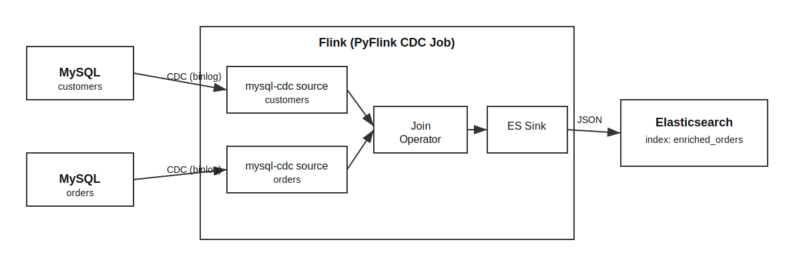

# Apache-Flink-CDC (MySQL to Elasticsearch)

A PyFlink CDC demo that streams row-level changes from MySQL (Debezium image) into Elasticsearch. The job joins `customers` and `orders` and writes enriched orders into the `enriched_orders` index.

Inspired by: https://youtu.be/EWrXukytE7s?si=GusGhJZAY85-eHIW

## Architecture
- Source: MySQL binlog via `mysql-cdc`
- Processing: PyFlink Table API join
- Sink: Elasticsearch 7.x index



```mermaid
flowchart LR
  subgraph MySQL["MySQL (Debezium)"]
    C[customers]:::table
    O[orders]:::table
  end

  subgraph Flink["Flink (PyFlink CDC Job)"]
    S1[mysql-cdc source\ncustomers]:::proc
    S2[mysql-cdc source\norders]:::proc
    J[Join Operator]:::proc
    ES[Elasticsearch Sink]:::proc
  end

  ESINK[(Elasticsearch 7.x\nindex: enriched_orders)]:::store

  C -->|CDC (binlog)| S1
  O -->|CDC (binlog)| S2
  S1 --> J
  S2 --> J
  J -->|JSON| ES
  ES --> ESINK

  classDef table fill:#f7f7f7,stroke:#999,color:#222;
  classDef proc fill:#e8f4ff,stroke:#4f81bd,color:#222;
  classDef store fill:#fff3e0,stroke:#fb8c00,color:#222;
```

```text
MySQL (Debezium)                 Flink (PyFlink CDC Job)                       Elasticsearch
┌───────────────┐           ┌──────────────────────────────────────┐      ┌───────────────────────┐
│ customers     │ --CDC-->  │ mysql-cdc source (customers)         │      │ Elasticsearch 7.x     │
└───────────────┘           │           \                          │      │ index: enriched_orders│
┌───────────────┐           │            >-- Join Operator --JSON--->----> └───────────────────────┘
│ orders        │ --CDC-->  │           /                          │
└───────────────┘           │ mysql-cdc source (orders)            │
                            └──────────────────────────────────────┘
```

## Prerequisites
- Docker and Docker Compose

## Project Layout
- `main.py`: PyFlink job (CDC sources, join, Elasticsearch sink)
- `docker-compose.yml`: MySQL, Elasticsearch, Flink JobManager/TaskManager
- `sql/Dockerfile`: Custom Flink image with Python, PyFlink, and connectors
- `sql/init.sql`: MySQL schema + seed data
- `steps.md`: Detailed setup guide

## Quick Start
1) Build and start the stack:
```bash
docker compose up --build
```
2) Submit the PyFlink job (from another terminal):
```powershell
docker exec -it apache-flink-cdc-jobmanager-1 flink run -py /opt/flink/usrlib/main.py
```
3) Verify data in Elasticsearch:
```bash
curl -s http://localhost:9200/enriched_orders/_search?pretty
```

## Testing CDC
Insert new data and watch it appear in Elasticsearch:
```bash
docker exec -it apache-flink-cdc-mysql-1 mysql -uroot -pdebezium -e "USE inventory; INSERT INTO customers (name, email) VALUES ('Jane Smith', 'jane@example.com'); INSERT INTO orders (customer_id, product, amount) VALUES (2, 'Smartphone', 800.00);"
```

## Troubleshooting
- Flink UI: http://localhost:8081
- MySQL logs:
```bash
docker logs apache-flink-cdc-mysql-1
```
- TaskManager logs:
```bash
docker logs apache-flink-cdc-taskmanager-1
```

## Why this setup
- Faster startup: Python + connectors are baked into the image.
- Cleaner compose: no runtime `pip` or `wget` in service commands.
- Reproducible: consistent dependency versions across runs.


-- Rajesh Daggupati